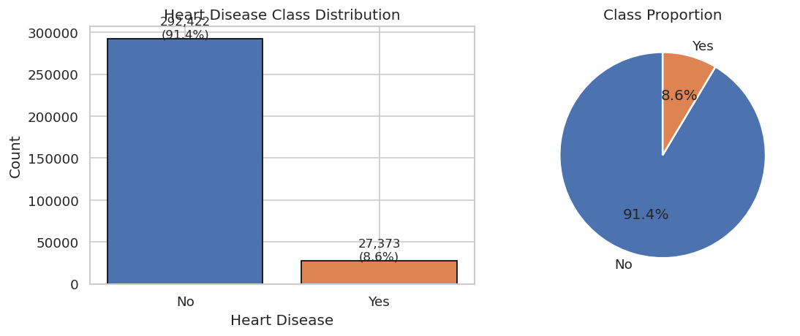
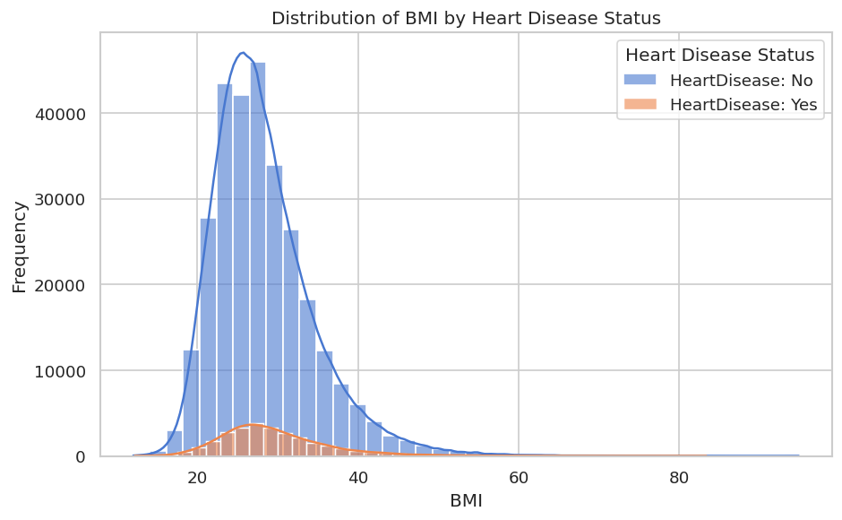
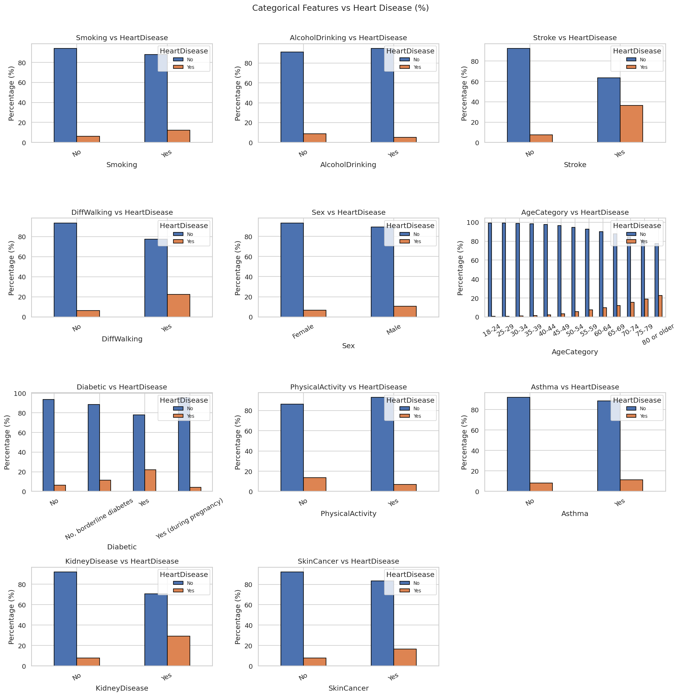
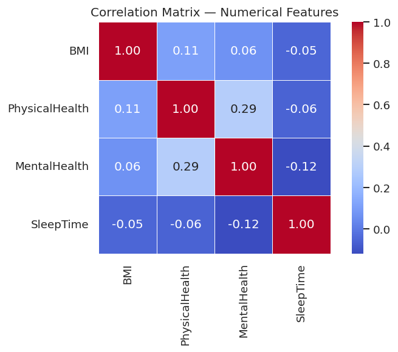
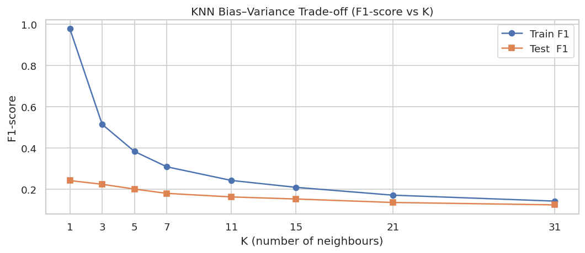
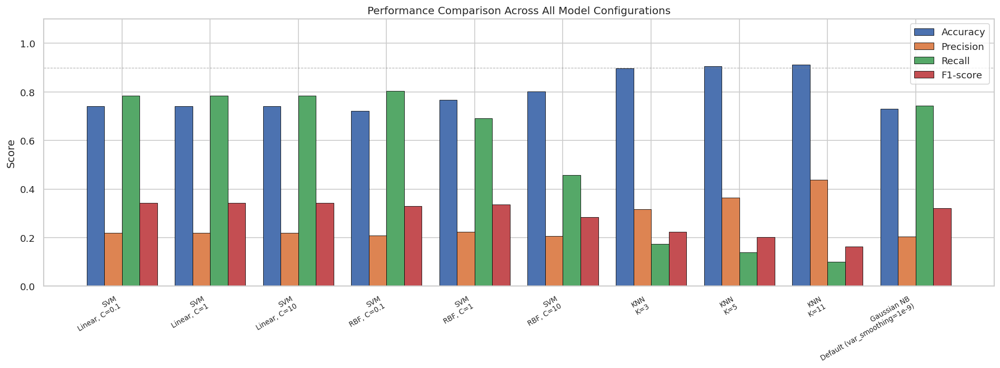
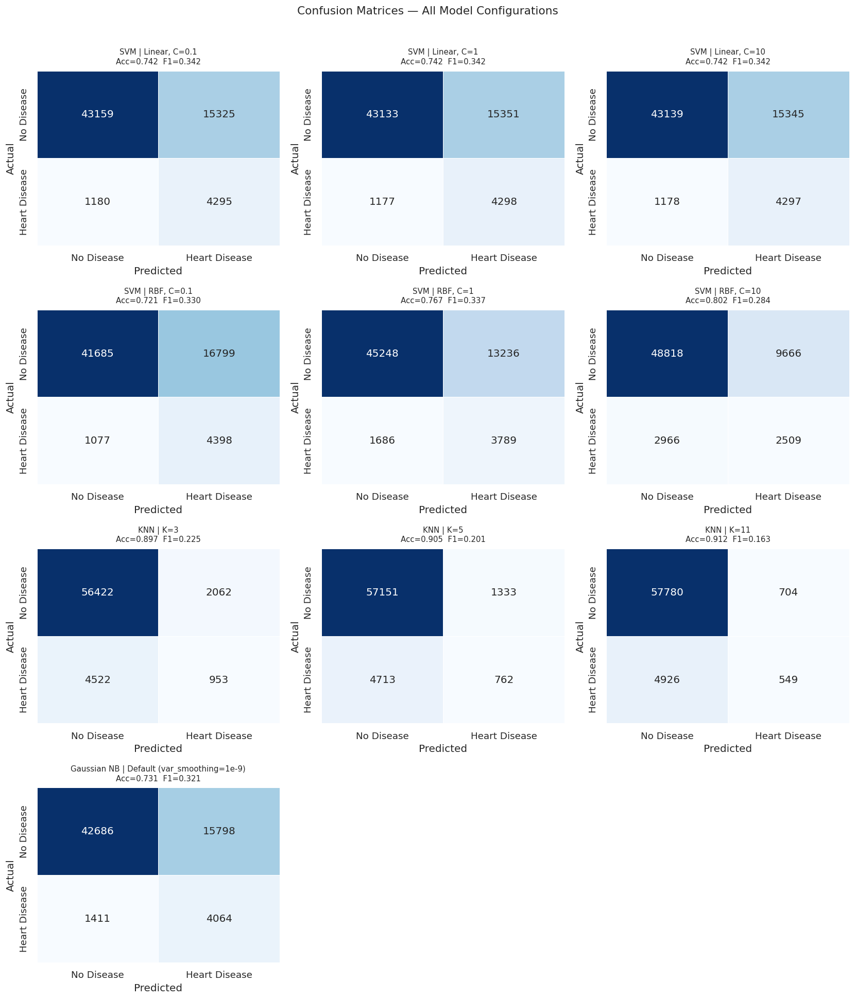

# 🩺 Heart Disease Prediction: Benchmarking ML Classifiers

[](https://www.python.org/)
[](https://scikit-learn.org/)
[](https://jupyter.org/)
[](https://opensource.org/licenses/MIT)

A comprehensive machine learning course project comparing **Support Vector Machines (SVM)**, **K-Nearest Neighbors (KNN)**, and **Gaussian Naive Bayes (GNB)** classifiers to predict heart disease risk. This project implements a full end-to-end pipeline including exploratory data analysis (EDA), statistical visualization, categorical encoding, stratified data splitting, feature scaling, hyperparameter exploration, and model performance evaluation tailored for medical screening contexts.

---

## 📌 Table of Contents
1. [Project Overview](#-project-overview)
2. [Dataset & Features](#-dataset--features)
3. [Exploratory Data Analysis (EDA)](#-exploratory-data-analysis-eda)
4. [Data Preprocessing Pipeline](#-data-preprocessing-pipeline)
5. [Model Training & Benchmarking](#-model-training--benchmarking)
6. [Key Findings & Performance Analysis](#-key-findings--performance-analysis)
7. [Clinical Recommendation](#-clinical-recommendation)
8. [Project Structure](#-project-structure)
9. [Installation & Usage](#-installation--usage)
10. [Future Directions](#-future-directions)

---

## 🔍 Project Overview

Predicting heart disease is one of the most critical applications of machine learning in healthcare. Early detection allows for preventative lifestyle changes and clinical interventions, which can dramatically lower mortality rates. 

This project benchmarks three distinct classification paradigms on the Kaggle *Personal Key Indicators of Heart Disease* dataset:
*   **Distance-based Classifiers:** K-Nearest Neighbors (KNN)
*   **Boundary-optimizing Classifiers:** Support Vector Machines (SVM) with Linear and RBF Kernels
*   **Probabilistic Classifiers:** Gaussian Naive Bayes (GNB)

A core focus of this project is addressing the severe **class imbalance** (only ~8.56% of patients have heart disease) and understanding the clinical tradeoffs between **Precision** and **Recall**.

---

## 📊 Dataset & Features

The project utilizes the **Personal Key Indicators of Heart Disease** dataset from Kaggle, containing **319,795 records** collected from the 2020 CDC BRFSS telephone survey.

### Feature Specification Table

| Feature Name | Data Type | Description / Value Range |
| :--- | :--- | :--- |
| **HeartDisease** *(Target)* | Binary Object | Whether the respondent has ever been told they have coronary heart disease (CHD) or myocardial infarction (MI) [`Yes`, `No`] |
| **BMI** | Numeric (Float) | Body Mass Index (weight in kg / height in m²) [Range: 12.02 – 94.85] |
| **Smoking** | Binary Object | Has the respondent smoked at least 100 cigarettes in their entire life? [`Yes`, `No`] |
| **AlcoholDrinking** | Binary Object | Heavy drinkers (adult men having >14 drinks/week, adult women having >7 drinks/week) [`Yes`, `No`] |
| **Stroke** | Binary Object | Has the respondent ever had a stroke? [`Yes`, `No`] |
| **PhysicalHealth** | Numeric (Float) | For how many days during the past 30 days was your physical health not good? [Range: 0.0 – 30.0] |
| **MentalHealth** | Numeric (Float) | For how many days during the past 30 days was your mental health not good? [Range: 0.0 – 30.0] |
| **DiffWalking** | Binary Object | Do you have serious difficulty walking or climbing stairs? [`Yes`, `No`] |
| **Sex** | Binary Object | Respondent's gender [`Male`, `Female`] |
| **AgeCategory** | Categorical Object | 13-level age categories starting from `18-24` to `80 or older` |
| **Race** | Categorical Object | Respondent's race/ethnicity [`White`, `Black`, `Asian`, `American Indian/Alaskan Native`, `Hispanic`, `Other`] |
| **Diabetic** | Categorical Object | Diabetes status [`Yes`, `No`, `No, borderline diabetes`, `Yes (during pregnancy)`] |
| **PhysicalActivity** | Binary Object | Adults who reported doing physical activity or exercise during the past 30 days other than their regular job [`Yes`, `No`] |
| **GenHealth** | Categorical Object | Self-reported general health status [`Excellent`, `Very good`, `Good`, `Fair`, `Poor`] |
| **SleepTime** | Numeric (Float) | Average hours of sleep in a 24-hour period [Range: 1.0 – 24.0] |
| **Asthma** | Binary Object | Has the respondent ever been told they have asthma? [`Yes`, `No`] |
| **KidneyDisease** | Binary Object | Has the respondent ever been told they have kidney disease (excluding kidney stones, bladder infection)? [`Yes`, `No`] |
| **SkinCancer** | Binary Object | Has the respondent ever been told they have skin cancer? [`Yes`, `No`] |

---

## 📈 Exploratory Data Analysis (EDA)

The data was analyzed to identify distributions, relationships, and the presence of class imbalance.

### 1. Target Class Imbalance
The dataset exhibits a severe class imbalance with **91.44% (292,422) "No Heart Disease"** labels and only **8.56% (27,373) "Heart Disease"** labels. This significantly impacts classifier evaluation, showing that accuracy alone is a deceptive metric.



### 2. BMI Distribution
The Body Mass Index (BMI) peaks around 25-30 (Overweight range), with a right-skewed distribution stretching out to extreme values (90+), representing severe obesity.



### 3. Categorical Risk Factors
EDA shows strong associations between categorical variables and heart disease. For example, individuals with a history of **Stroke**, **Difficulty Walking (DiffWalking)**, or those categorized with **Poor General Health** show a significantly higher proportion of heart disease.



### 4. Correlation Heatmap
A correlation matrix calculated on numerical variables (`BMI`, `PhysicalHealth`, `MentalHealth`, `SleepTime`) shows a moderate positive correlation (approx. 0.29) between bad physical health days and bad mental health days.



---

## ⚙️ Data Preprocessing Pipeline

To prepare the data for distance-based (KNN) and boundary-based (SVM) classifiers, a robust preprocessing pipeline was implemented:

1.  **Defensive Missing Value Audit:** Checked for missing data. In case of future missing splits, a pipeline-fallback imputes numerical columns with their *median* (outlier-robust) and categorical columns with their *mode*.
2.  **Target Encoding:** Mapped `HeartDisease` binary values: `Yes` $\rightarrow$ `1`, `No` $\rightarrow$ `0`.
3.  **One-Hot Encoding (OHE):** Applied to nominal categorical attributes (`AgeCategory`, `Race`, `Diabetic`, `GenHealth`, `Sex`, etc.). To prevent multicollinearity and dodge the **dummy variable trap**, we dropped the first category (`drop_first=True`).
4.  **Stratified Train/Test Split:** Split the dataset into **80% Training** (255,836 samples) and **20% Testing** (63,959 samples). Using `stratify=y` guarantees that the 8.56% heart disease ratio is perfectly preserved in both subsets.
5.  **Feature Scaling (StandardScaler):** 
    *   **Applied to:** SVM and KNN (since they rely on Euclidean distance / margin optimization). Without scaling, a feature like `BMI` (range 10–95) would completely dwarf a one-hot encoded binary feature (range 0–1).
    *   **Not applied to:** Gaussian Naive Bayes (since it models independent probability density functions directly on raw distributions).
    *   *Data Leakage Prevention:* The scaler was fitted *only* on the training dataset and then applied to transform both training and testing datasets.

---

## 🏆 Model Training & Benchmarking

We trained and evaluated **10 different model configurations**. To combat class imbalance, SVM variants utilized cost-sensitive learning (`class_weight='balanced'`), while KNN was tested across different neighbor thresholds.

### Consolidated Performance Table

| Model | Hyperparameters | Test Accuracy | Precision | Recall (Sensitivity) | F1-score |
| :--- | :--- | :---: | :---: | :---: | :---: |
| **SVM (Linear)** | $C = 0.1$, class_weight='balanced' | 74.19% | 21.89% | 78.45% | 0.3423 |
| **SVM (Linear)** | $C = 1.0$, class_weight='balanced' | 74.16% | 21.87% | 78.50% | 0.3421 |
| **SVM (Linear)** | $C = 10.0$, class_weight='balanced' | 74.17% | 21.88% | 78.48% | 0.3422 |
| **SVM (RBF)** | $C = 0.1$, class_weight='balanced' | 72.05% | 20.75% | **80.33%** | 0.3298 |
| **SVM (RBF)** | $C = 1.0$, class_weight='balanced' | 76.67% | 22.26% | 69.21% | **0.3368** |
| **SVM (RBF)** | $C = 10.0$, class_weight='balanced' | 80.25% | 20.61% | 45.83% | 0.2843 |
| **KNN** | $K = 3$, uniform weights | 89.71% | 31.61% | 17.41% | 0.2245 |
| **KNN** | $K = 5$, uniform weights | 90.55% | 36.37% | 13.92% | 0.2013 |
| **KNN** | $K = 11$, uniform weights | **91.20%** | **43.81%** | 10.03% | 0.1632 |
| **Gaussian NB** | Default ($var\_smoothing = 10^{-9}$) | 73.09% | 20.46% | 74.23% | 0.3208 |

---

## 📈 Key Findings & Performance Analysis

### 1. The Accuracy Paradox
The K-Nearest Neighbors classifier at $K=11$ achieved the highest accuracy (**91.20%**). However, it suffered from a critically low Recall (**10.03%**), meaning it missed roughly **90% of actual heart disease cases**. This occurs because the standard KNN algorithm minimizes global error, biasing its predictions toward the majority "No" class. In a healthcare environment, this model would be extremely dangerous.

### 2. SVM RBF Kernel Dynamics
*   At **$C = 0.1$**, the SVM RBF model achieves the **highest Recall (80.33%)** among all models, classifying the maximum number of true positives.
*   As the regularization parameter **$C$ increases** ($C \rightarrow 1.0 \rightarrow 10.0$), the margin narrows and penalizes training errors more heavily. This shifts the model to prioritize precision over recall, causing Recall to drop from **80.33%** to **45.83%**, while accuracy rises to **80.25%**.

### 3. KNN Bias-Variance Trade-off
As $K$ increases from 3 to 11:
*   The model boundary becomes smoother, reducing variance and increasing overall generalization accuracy (89.71% $\rightarrow$ 91.20%).
*   However, because there is no minority oversampling or class-weighting applied, the minority class is increasingly drowned out in larger neighbor spheres, causing Recall to drop from 17.41% to 10.03%.



### 4. Consolidated Metric Comparison & Confusion Matrices
Below are the consolidated comparisons showing how accuracy, precision, recall, and F1-score trade off across the different classifiers, along with their respective confusion matrices:

| Metric Comparisons | Confusion Matrices |
| :---: | :---: |
|  |  |

---

## 🩺 Clinical Recommendation

In clinical screening contexts, **False Negatives (missed diagnoses)** are significantly more dangerous than **False Positives (unnecessary follow-ups)**. A patient sent home with undetected heart disease faces severe risk, whereas a false positive is easily corrected via secondary, more precise diagnostic tests (e.g., ECGs, angiograms).

*   **Primary Recommendation for Screenings:** **SVM RBF with $C=0.1$ (Balanced)**. It flags **80.33%** of all positive cases (highest sensitivity), ensuring minimal missed diagnoses.
*   **Alternative for Low-Resource Environments:** **Gaussian Naive Bayes**. It achieves a solid **74.23%** Recall, requires no features scaling, and processes the massive dataset in milliseconds compared to the high computational memory footprint of SVM RBF.

---

## 📂 Project Structure

```bash
ml-heart-disease-prediction/
├── heart_2020_cleaned.csv        # CDC BRFSS Dataset (ignored in Git; 25MB)
├── heart_disease_classifier.ipynb # Core Jupyter Notebook (EDA, Models & Visuals)
├── heart_disease_classifier.pdf   # Exported PDF report of the Notebook
├── requirements.txt               # Dependencies list
├── .gitignore                     # Git ignore rules for virtualenv/data/checkpoints
├── README.md                      # Comprehensive project documentation
│
└── [Generated Plots]
    ├── target_imbalance.png       # Target variable distribution
    ├── bmi_distribution.png       # BMI distribution histogram
    ├── categorical_eda.png        # Categorical variables vs Target
    ├── numerical_eda.png          # Numerical variable distributions
    ├── correlation_heatmap.png    # Correlation matrix of numeric attributes
    ├── knn_bias_variance.png      # KNN train/test accuracy vs K
    ├── confusion_matrices.png     # Heatmaps of model predictions
    └── metric_comparison.png      # Bar chart comparing all classifiers
```

---

## 🚀 Installation & Usage

### Prerequisites
*   Python 3.8 or higher
*   Jupyter Notebook or JupyterLab

### Step-by-step Setup
1.  **Clone the repository:**
    ```bash
    git clone https://github.com/Tareq-Islam/ml-heart-disease-prediction.git
    cd ml-heart-disease-prediction
    ```

2.  **Create and activate a virtual environment:**
    ```bash
    python3 -m venv venv
    source venv/bin/activate  # On Windows: venv\Scripts\activate
    ```

3.  **Install dependencies:**
    ```bash
    pip install -r requirements.txt
    ```

4.  **Download the dataset:**
    *   Download `heart_2020_cleaned.csv` from the [Kaggle Dataset Page](https://www.kaggle.com/datasets/kamilpytlak/personal-key-indicators-of-heart-disease).
    *   Place the file directly inside the project root folder.

5.  **Run the analysis:**
    Launch Jupyter Notebook to interact with the pipeline:
    ```bash
    jupyter notebook heart_disease_classifier.ipynb
    ```

---

## 🔮 Future Directions

To further improve prediction scores and build a more robust model:
1.  **SMOTE (Synthetic Minority Over-sampling Technique):** Generate synthetic minority class samples during preprocessing to train the models on a balanced subset.
2.  **Ensemble Methods:** Train tree-based algorithms like **Random Forest**, **XGBoost**, and **LightGBM**, which are highly resilient to class imbalance and scale well.
3.  **Hyperparameter Optimization:** Integrate `GridSearchCV` or `Optuna` to sweep large parameters ranges efficiently.
4.  **Threshold Tuning:** Adjust classification thresholds on predicted probability scores (instead of relying on standard 0.5 cuts) to maximize Recall while keeping Precision reasonable.
